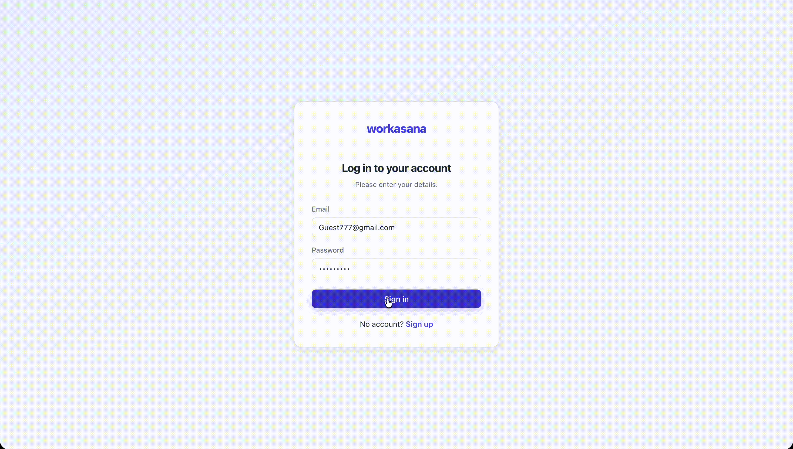

# Workasana

A full-stack task and project management app to organize projects, assign tasks to teams, track task status through the pipeline, tag and filter work, and view performance reports.

Built with a React frontend, Express/Node backend, MongoDB (Mongoose) database, and JWT-based authentication.



## Demo Link

[Live Demo](https://workasana-frontend-pearl.vercel.app/) • [Backend API](https://workasana-backend-phi.vercel.app/)

## Login

**Guest**

- Email: `Guest777@gmail.com`
- Password: `123123123`

## Quick Start

This project has two folders: `frontend` and `backend`. (The frontend and backend are also in separate GitHub repos.)

### Backend

```
git clone https://github.com/rahulsoni070/workasana-backend.git
cd workasana-backend
npm install
npm run dev
```

### Frontend

```
git clone https://github.com/rahulsoni070/workasana-frontend.git
cd workasana-frontend
npm install
npm run dev
```

## Environment Variables

Create a `.env` file in the backend with:

```
MONGO_URI=<your-mongodb-connection-string>
JWT_SECRET=<your-secret-key>
PORT=5001
```

Create a `.env` file in the frontend with:

```
VITE_API_URL=<your-backend-url>
```

## Technologies

- React JS
- React Router
- Vite
- Node.js
- Express
- MongoDB (Mongoose)
- JWT (JSON Web Token)
- Chart.js

## Features

### Authentication

- User signup and login with JWT
- Protected routes — dashboard and data are inaccessible without a valid token

### Dashboard

- Overview of all projects as cards
- Task list with status badges, filtering, and sorting

### Projects

- Create and view projects
- View all tasks belonging to a specific project

### Teams

- Create and view teams
- Assign tasks to a team

### Tasks

- Create, view, update, and delete tasks
- Auto-assigns the logged-in user as the task owner
- Add tags to a task — pick from existing tags or create new ones on the fly
- Set a due date and estimated time (in days)
- Track status: To Do, In Progress, Completed, Blocked
- Filter tasks by status, team, and project
- Sort tasks by newest or by estimated time

### Reports

- Total work completed in the last 7 days
- Total days of work still pending
- Tasks closed, grouped by team

## API Reference

All routes require an `Authorization: Bearer <token>` header unless noted otherwise.

### Auth

`POST /auth/signup` — Register a new user

Sample Response:
```
{ "message": "User registered successfully", "user": { "id": "...", "name": "...", "email": "..." } }
```

`POST /auth/login` — Log in and receive a JWT

Sample Response:
```
{ "message": "Login successful", "token": "...", "user": { "id": "...", "name": "...", "email": "..." } }
```

`GET /auth/me` — Get the currently logged-in user's profile

### Tasks

`GET /tasks` — List all tasks (supports filters: `status`, `team`, `project`, `owner`, `tags`)

Sample Response:
```
[{ "_id": "...", "name": "...", "project": { "name": "..." }, "team": { "name": "..." }, "owners": [{ "name": "..." }], "tags": ["..."], "dueDate": "...", "estimatedTime": 3, "status": "..." }, ...]
```

`POST /tasks` — Create a new task (owner is auto-assigned from the logged-in user)

`POST /tasks/:id` — Update a task

`DELETE /tasks/:id` — Delete a task

### Projects

`GET /projects` — List all projects

Sample Response:
```
[{ "_id": "...", "name": "...", "description": "..." }, ...]
```

`POST /projects` — Create a new project

### Teams

`GET /teams` — List all teams

`POST /teams` — Create a new team

### Tags

`GET /tags` — List all tags

`POST /tags` — Create a new tag

### Reports

`GET /report/last-week` — Get tasks completed in the last 7 days

`GET /report/pending` — Get count and total estimated days of pending tasks

`GET /report/closed-tasks` — Get completed tasks grouped by team

## Contact

For bugs or feature requests, please reach out to [rahulsoni66676@gmail.com](mailto:rahulsoni66676@gmail.com)
